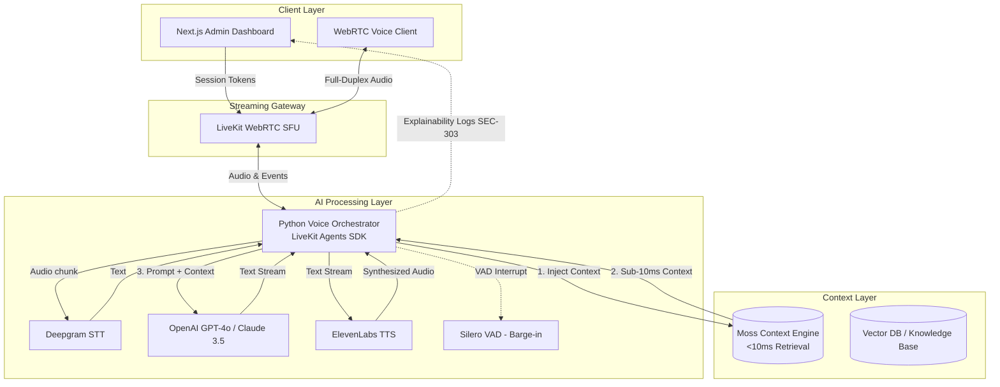

# 🎙️ Zero-Latency Voice Builder Sprint (Track 1)

🌐 **Live Demo:** [https://ychackathon.vercel.app](https://ychackathon.vercel.app)  
*(Dashboard: https://vercel.com/nrvtech2808-7448s-projects/ychackathon)*

This repository contains our submission for the **YC Fall 2026 x Moss Hackathon (Track 1)**. 

We have built a mission-critical, real-time Voice AI Platform designed for field workers, dispatchers, and healthcare professionals. By replacing traditional high-latency vector databases with **Moss** and substituting standard websockets with **LiveKit WebRTC**, we have successfully created an intelligent, interruptible voice agent capable of operating with sub-500ms Turn-Around Time (TAT).

---

## 🏗️ System Architecture

Our streaming microservices architecture minimizes glass-to-glass latency by pipelining STT, context retrieval, and TTS concurrently over a WebRTC transport layer.

*(See the original [Architecture PDF](./architecture-a3-1789308242480.pdf) for detailed specs).*



---

## 📋 Product Requirements (PRD) Summary

The complete requirements, acceptance criteria, and architecture traceability matrix can be found in the **[PRD_Track1.md](./PRD_Track1.md)** document.

### Core Objectives
* **Ultra-Low Latency (NFR-201):** Achieve total response latency (STT + LLM + TTS) under 500ms.
* **Real-Time Voice (FR-101):** Full-duplex communication using LiveKit WebRTC SFU with <50ms transport latency.
* **Instant Context (FR-102):** Integrate Moss to fetch semantic session state and technical protocols in <10ms.
* **Interruptibility (FR-104):** Silero VAD instantly halts TTS playback when user speech is detected.
* **AI Explainability (SEC-303):** Provide transparent real-time logs in the UI detailing exact Moss context traces used for generated responses.
* **Data Erasure (SEC-302):** Automated lifecycle policies to purge voice recordings within 24 hours.

---

## 🌟 Key Features

* **Multi-Industry Personas:** Dynamically toggle between Field Worker, Healthcare Triage, Emergency Dispatch, and Customer Support personas to demonstrate Moss's versatility.
* **Ultra-Low Latency Transport:** Full-duplex audio streaming powered by LiveKit, avoiding HTTP/WebSocket bottlenecks.
* **Sub-10ms Semantic Context:** Integrates the Moss engine to instantly inject real-time session state (like technical manuals or live logs) into the LLM before generation.
* **Next.js Admin Dashboard:** A slick, real-time web portal that securely mints session tokens and allows admins to view connection metrics and AI explainability logs.
* **CRISPE Prompt Engineering:** Context-aware prompts optimized for concise, TTS-friendly output.

---

## 🚀 Quick Start Guide

### 1. Start the Voice Orchestrator (Backend)

Navigate to the `agent/` directory:
```bash
cd agent
python3 -m venv venv
source venv/bin/activate
pip install -r requirements.txt
```

Copy the `.env.example` file to `.env` and add your API keys:
```bash
cp .env.example .env
```

Run the agent worker:
```bash
python agent.py dev
```

### 2. Start the Dashboard (Frontend)

Open a new terminal and navigate to the `frontend/` directory:
```bash
cd frontend
npm install
```

Copy the `.env.local.example` to `.env.local`:
```bash
cp .env.local.example .env.local
```

Run the Next.js development server:
```bash
npm run dev
```

Open [http://localhost:3000](http://localhost:3000) in your browser and click **Start Secure Session**!

---

## 🛡️ Continuous Integration (CI)

This repository is equipped with GitHub Actions located in `.github/workflows`:
- **Frontend Build Check:** Ensures Next.js builds successfully on every pull request.
- **Backend Python Check:** Verifies Python syntax and validates dependencies.
